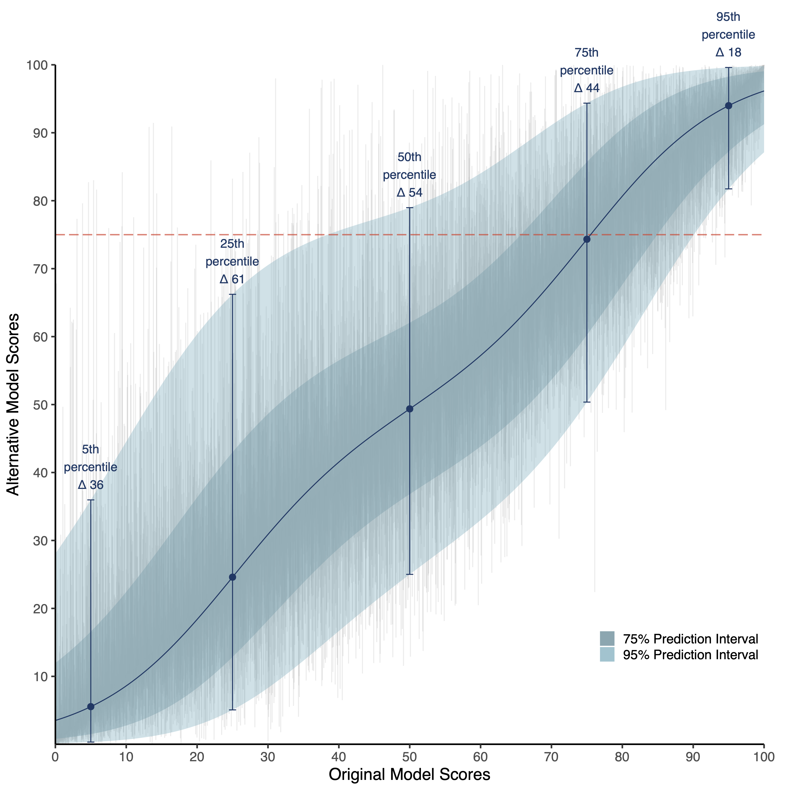

<!-- README.md is generated from README.Rmd. Please edit that file -->

```{r, include = FALSE}
knitr::opts_chunk$set(
  collapse = TRUE,
  comment = "#>"
)
```

## Potential for allocative harm in an environmental justice data tool




This repository, [`allocative_harm`](https://github.com/etchin/allocative_harm), contains reproducible code for our manuscript, "Potential for allocative harm in an environmental justice data tool".

## Details

All code can be found in the `./code` directory and must be run in order (numerically and alphabetically). Files matching the pattern `00_*R` contain functions used by other files. Figures are in the `./figs` directory. 

Due to file size limitations on Github, the files in `./data` and are *not* uploaded to this repository. Data urls are located in `./code/00_parameters.R` and will be downloaded when running `./code/01_download_data.R` unless otherwise noted. All data necessary to run these analyses can be found in this [`data repository`](https://doi.org/10.7910/DVN/EVWNC2).

## Authors (alphabetical)
-   [Elizabeth T. Chin](https://etchin.github.io/)
-   [Daniel E. Ho](https://dho.stanford.edu/)
-   [Benjamin Q. Huynh](https://benhuynh.github.io/)
-   [Mathew V. Kiang](https://mathewkiang.com/)
-   [Allison Koenecke](https://koenecke.infosci.cornell.edu/)
-   [Derek Ouyang](https://derekouyang.com/)
-   [David H Rehkopf](https://profiles.stanford.edu/david-rehkopf)


## Package management

We use [`renv`](https://rstudio.github.io/renv/index.html), but below we also include the relevant information to ensure reproducibility.

```{r, eval=FALSE}
> sessioninfo::session_info(pkgs = "attached")
─ Session info ─────────────────────────────────────────────────────────────────────────────────────────────────────────────────────────────────────────────────────────────────────────────────────────────────────────────────────
 setting  value
 version  R version 4.2.3 (2023-03-15)
 os       macOS Ventura 13.2.1
 system   x86_64, darwin22.3.0
 ui       RStudio
 language (EN)
 collate  en_US.UTF-8
 ctype    en_US.UTF-8
 date     2023-04-12
 rstudio  2023.03.0+386 Cherry Blossom (desktop)
 pandoc   2.19.2 @ /Applications/RStudio.app/Contents/Resources/app/quarto/bin/tools/ (via rmarkdown)

─ Packages ─────────────────────────────────────────────────────────────────────────────────────────────────────────────────────────────────────────────────────────────────────────────────────────────────────────────────────────
package      * version    date (UTC) lib source
AER          * 1.2-10     2022-06-14 [?] CRAN (R 4.2.3)
broom        * 1.0.4      2023-03-11 [?] CRAN (R 4.2.3)
car          * 3.1-2      2023-03-30 [?] CRAN (R 4.2.3)
carData      * 3.0-5      2022-01-06 [?] CRAN (R 4.2.3)
caret        * 6.0-94     2023-03-21 [?] CRAN (R 4.2.3)
CBPS         * 0.23       2022-01-18 [?] CRAN (R 4.2.3)
censusapi    * 0.8.0      2022-08-09 [?] CRAN (R 4.2.3)
cobalt       * 4.5.0      2023-03-22 [?] CRAN (R 4.2.3)
corrplot     * 0.92       2021-11-18 [?] CRAN (R 4.2.3)
cowplot      * 1.1.1      2020-12-30 [?] CRAN (R 4.2.3)
data.table   * 1.14.8     2023-02-17 [?] CRAN (R 4.2.3)
dfoptim      * 2020.10-1  2020-10-20 [?] CRAN (R 4.2.3)
downloader   * 0.4        2015-07-09 [?] CRAN (R 4.2.3)
dplyr        * 1.1.1      2023-03-22 [?] CRAN (R 4.2.3)
forcats      * 1.0.0      2023-01-29 [?] CRAN (R 4.2.3)
Formula      * 1.2-5      2023-02-24 [?] CRAN (R 4.2.3)
ggalluvial   * 0.12.5     2023-02-22 [?] CRAN (R 4.2.3)
ggdensity    * 1.0.0      2023-02-09 [?] CRAN (R 4.2.3)
ggplot2      * 3.4.2      2023-04-03 [?] CRAN (R 4.2.3)
ggpmisc      * 0.5.2      2022-12-17 [?] CRAN (R 4.2.3)
ggpp         * 0.5.1      2023-02-03 [?] CRAN (R 4.2.3)
ggpubr       * 0.6.0      2023-02-10 [?] CRAN (R 4.2.3)
glmnet       * 4.1-7      2023-03-23 [?] CRAN (R 4.2.3)
grf          * 2.2.1      2022-12-14 [?] CRAN (R 4.2.3)
lattice      * 0.20-45    2021-09-22 [?] CRAN (R 4.2.3)
lmtest       * 0.9-40     2022-03-21 [?] CRAN (R 4.2.3)
lqr          * 5.0        2022-08-15 [?] CRAN (R 4.2.3)
lubridate    * 1.9.2      2023-02-10 [?] CRAN (R 4.2.3)
MASS         * 7.3-58.2   2023-01-23 [?] CRAN (R 4.2.3)
MatchIt      * 4.5.2      2023-03-22 [?] CRAN (R 4.2.3)
Matrix       * 1.5-3      2022-11-11 [?] CRAN (R 4.2.3)
matrixStats  * 0.63.0     2022-11-18 [?] CRAN (R 4.2.3)
mgcv         * 1.8-42     2023-03-02 [?] CRAN (R 4.2.3)
mice         * 3.15.0     2022-11-19 [?] CRAN (R 4.2.3)
nlme         * 3.1-162    2023-01-31 [?] CRAN (R 4.2.3)
nnet         * 7.3-18     2022-09-28 [?] CRAN (R 4.2.3)
nortest      * 1.0-4      2015-07-30 [?] CRAN (R 4.2.3)
np           * 0.60-17    2023-03-13 [?] CRAN (R 4.2.3)
numDeriv     * 2016.8-1.1 2019-06-06 [?] CRAN (R 4.2.3)
optimx       * 2022-4.30  2022-05-10 [?] CRAN (R 4.2.3)
pbapply      * 1.7-0      2023-01-13 [?] CRAN (R 4.2.3)
pROC         * 1.18.0     2021-09-03 [?] CRAN (R 4.2.3)
purrr        * 1.0.1      2023-01-10 [?] CRAN (R 4.2.3)
rankdist     * 1.1.4      2019-07-27 [?] CRAN (R 4.2.3)
rdd          * 0.57       2016-03-14 [?] CRAN (R 4.2.3)
rddtools     * 1.6.0      2022-01-10 [?] CRAN (R 4.2.3)
readr        * 2.1.4      2023-02-10 [?] CRAN (R 4.2.3)
readxl       * 1.4.2      2023-02-09 [?] CRAN (R 4.2.3)
sandwich     * 3.0-2      2022-06-15 [?] CRAN (R 4.2.3)
scales       * 1.2.1      2022-08-20 [?] CRAN (R 4.2.3)
sf           * 1.0-12     2023-03-19 [?] CRAN (R 4.2.3)
stringr      * 1.5.0      2022-12-02 [?] CRAN (R 4.2.3)
summarytools * 1.0.1      2022-05-20 [?] CRAN (R 4.2.3)
survival     * 3.5-3      2023-02-12 [?] CRAN (R 4.2.3)
tibble       * 3.2.1      2023-03-20 [?] CRAN (R 4.2.3)
tidycensus   * 1.3.2      2023-01-30 [?] CRAN (R 4.2.3)
tidyr        * 1.3.0      2023-01-24 [?] CRAN (R 4.2.3)
tidyverse    * 2.0.0      2023-02-22 [?] CRAN (R 4.2.3)
tigris       * 2.0.1      2023-01-30 [?] CRAN (R 4.2.3)
treemapify   * 2.5.5      2021-01-08 [?] CRAN (R 4.2.3)
wesanderson  * 0.3.6      2018-04-20 [?] CRAN (R 4.2.3)
zoo          * 1.8-11     2022-09-17 [?] CRAN (R 4.2.3)
```